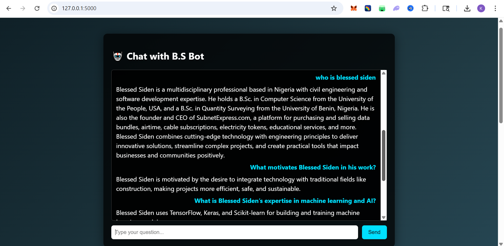

# 🤖 Chatbot Using Rasa (B.S Bot)

## 📌 Project Overview

This project implements an intelligent chatbot using the **Rasa Framework**, designed to answer FAQs about **Blessed Siden** and also handle **general user questions** using a GPT-2 fallback model.

The bot combines **rule-based responses**, **intent classification**, and **machine-learning–generated replies**, all wrapped in a simple web-based chat interface.

---

## 🚀 Features

- ✅ FAQ-based responses about Blessed Siden  
- ✅ General “ask anything” capability using GPT-2  
- ✅ Intent detection and dialogue management with Rasa  
- ✅ Custom Rasa actions using `rasa_sdk`  
- ✅ Flask-powered web chat UI  
- ✅ Clickable FAQ section for quick interaction  
- ✅ Smooth typing animation for bot responses  

---

## 🧠 How It Works

### 🔹 Rasa NLU
Handles:
- Intent classification
- Entity extraction
- Understanding user messages

### 🔹 Rasa Core
Manages:
- Dialogue flow
- Contextual conversations
- Decision-making on which response or action to trigger

### 🔹 Custom Action Server
- Handles predefined FAQs
- Uses **GPT-2** (Hugging Face Transformers) as a fallback for open-ended questions

### 🔹 Flask Web Interface
- Clean chat UI
- REST API communication with Rasa
- Persistent user sessions
- FAQ click-to-ask functionality

## 🖥 Demo

Screen recording (GIF or MP4) showing:
- Asking general questions
- Clicking FAQ items
- GPT-2 fallback responses

📸 Preview  

🎥 Full Demo  
https://github.com/user-attachments/assets/a04009b0-b11b-4964-99e3-1dd586050181

---

## ⚙️ Installation & Setup

### Install Dependencies
pip install rasa rasa-sdk flask transformers torch

### Train Model
rasa train

### Run Action Server
rasa run actions

### Run Rasa API
rasa run --enable-api --cors "*"

### Start Flask App
python app.py

Open browser at:
http://127.0.0.1:5000

---

## 🛠 Technologies Used

- Python
- Rasa (NLU & Core)
- Rasa SDK
- Flask
- Hugging Face Transformers
- GPT-2
- HTML, CSS, JavaScript

---

## 👨‍💻 Author

**Blessed Siden**

⭐ If you find this project useful, feel free to star the repository!
